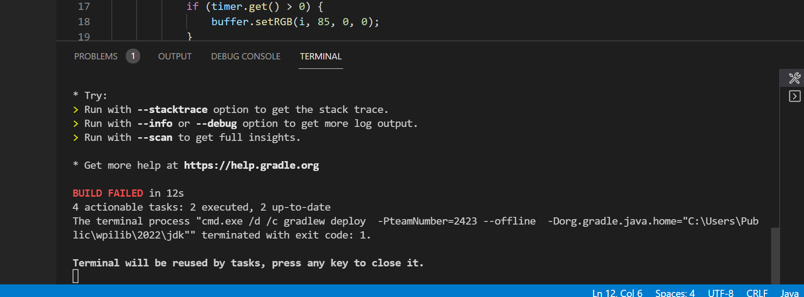
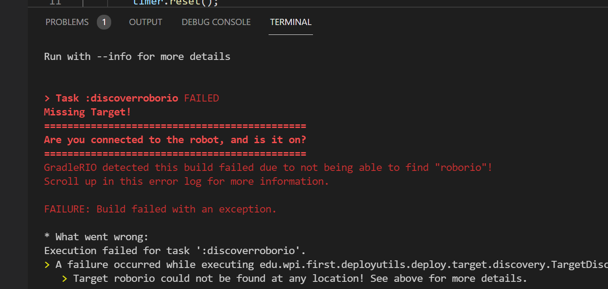
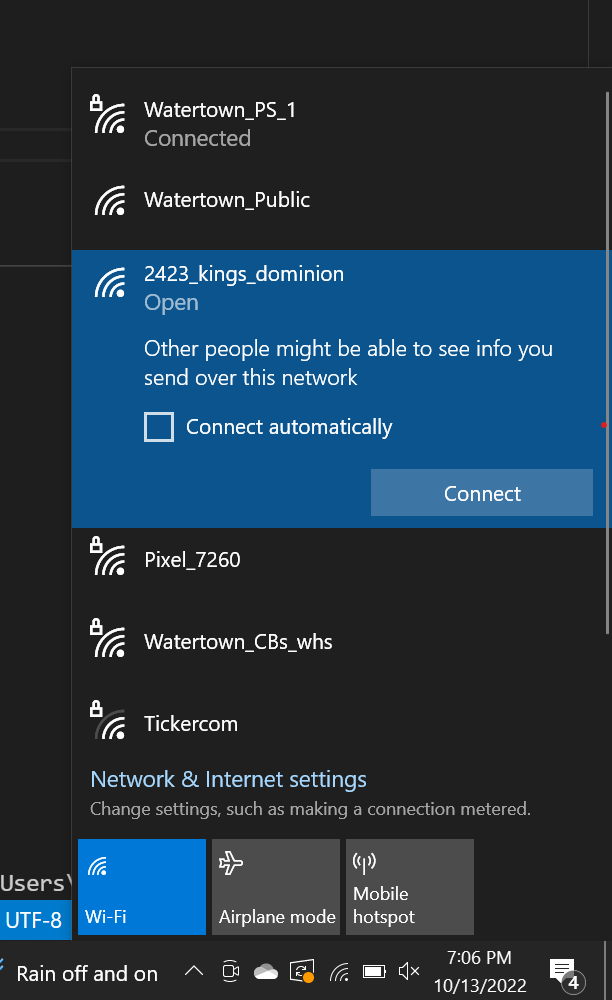
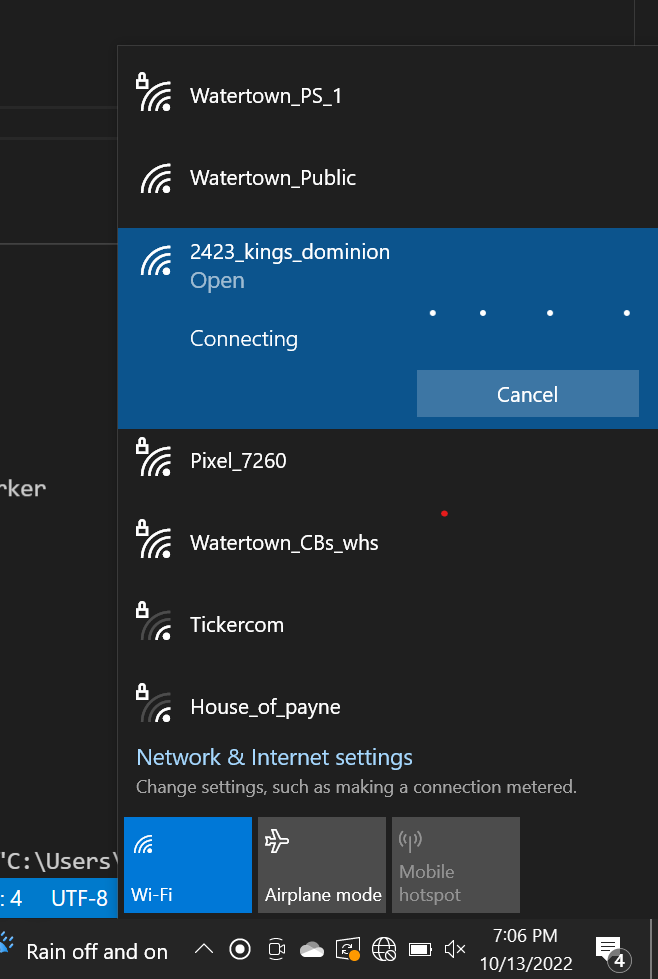

## Building and deploying

Documentation can be found here: https://docs.wpilib.org/en/stable/docs/software/vscode-overview/deploying-robot-code.html

## Debugging steps (disconnected from robot)

If you're deploying and you see this at the bottom of the screen, that means there's a problem you need to fix before you can deploy:

Scroll up in the terminal to see the errors:

If you see the above error that means you are not connected to your robot. Connect to the robot's radio. The network name should begin with `2423_`:

Ignore the "Connecting..." message as this remains even after you are already connected to the robot:

Now try deploying your robot code again.
