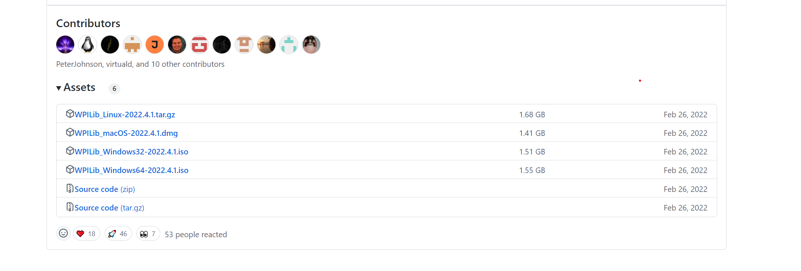

## Setting up your computer

To develop robot code you will need either a mac, windows or linux machine. A chromebook will not work. To get setup you will need to follow the below steps.

### Install WPILib

Follow the documentation found here to install WPILib: https://docs.wpilib.org/en/stable/docs/zero-to-robot/step-2/wpilib-setup.html

In the github releases link you should see a list of assets to download at the bottom of the page:

 Download the appropriate release for your operating system.

### Install FRC Driver Station and other software for Windows (Optional)

Follow the documentation here to install the FRC Driver Station software: https://docs.wpilib.org/en/stable/docs/zero-to-robot/step-2/frc-game-tools.html

### Install FRC Driver Station for Mac and Linux (Optional)

TODO

### Install git and signup on github

To share our code and work collaboratively, we use a version control system called `git` and host our code on `github`. To get started first create an account on https://github.com/. When you have an account, ask a mentor for an invitation to the team's organization for access to our code.

Next download `git`. You can download it here: https://git-scm.com/downloads

To be able to contribute, you must also add an ssh key to your github account: https://docs.github.com/en/authentication/connecting-to-github-with-ssh/adding-a-new-ssh-key-to-your-github-account

Finally, clone the `2022` repository here: https://github.com/frc2423/2022

Go here if you'd like to learn more about version control and git: https://git-scm.com/videos

### Installing 3rd party libraries 

Our code also relies on various 3rd party libraries. Follow the links below to download them:

REVLib (SPARK MAX and Color Sensor V3): https://docs.revrobotics.com/sparkmax/software-resources/spark-max-api-information#c++-and-java

NavX: https://www.kauailabs.com/public_files/navx-mxp/navx-mxp.zip

PhotonVision: https://docs.photonvision.org/en/latest/docs/programming/photonlib/adding-vendordep.html

PathPlannerLib: https://github.com/mjansen4857/pathplanner/wiki/PathPlannerLib:-Installing
